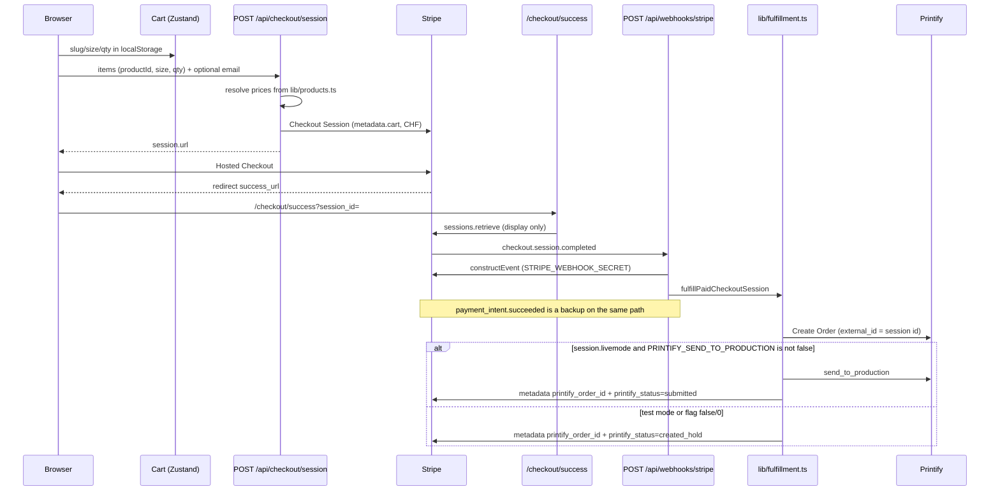

# Architecture

Paid checkout is server-side. The browser holds a cart of product id, size, and quantity. Stripe charges the amount computed from `lib/products.ts`. Printify is called only after Stripe says the session is paid.

## Request flow



`success_url` is `{site}/checkout/success?session_id={CHECKOUT_SESSION_ID}`. `cancel_url` is `{site}/checkout?canceled=1`. Site origin comes from `lib/site-url.ts` (`NEXT_PUBLIC_SITE_URL`, then `SITE_URL`, then the request host, then `VERCEL_PROJECT_PRODUCTION_URL`, then `VERCEL_URL`, else `http://localhost:3000`).

The success page does **not** create the Printify order. It only reads the session (`lib/order-confirmation.ts`) and, if `payment_status` is `paid`, clears the cart. Fulfillment runs in the webhook. Metadata may still be empty if the shopper lands before the webhook finishes; refresh to see `printify_order_id`.

## Idempotency

Printify `external_id` is the Stripe Checkout Session id (`cs_…`). Each line item also gets `external_id` `{sessionId}:{slug}:{size}`.

`fulfillPaidCheckoutSession` in `lib/fulfillment.ts`:

1. Skip unless `payment_status` is `paid` or `no_payment_required` (status `unpaid`, not written to metadata).
2. If metadata already has `printify_status=submitted` and `printify_order_id`, return `already_submitted` and do not call Printify again.
3. If an order id is already on the session, reuse it. Otherwise `findPrintifyOrderByExternalId` scans up to 5 pages × 50 orders for `external_id`, `metadata.shop_order_id`, or `metadata.shop_order_label`.
4. If still missing, `POST /shops/{shop}/orders.json`. If that throws, look up by `external_id` once more (create raced or the id already existed) and rethrow only if nothing is found.
5. Write `printify_order_id` and `printify_status=created`, then either `created_hold` (do not produce) or `send_to_production` and `submitted`.

Both the Checkout Session and its PaymentIntent get the same metadata patch (`printify_order_id`, `printify_status`). Failures to write metadata are logged; they do not undo the Printify order.

`payment_intent.succeeded` lists Checkout Sessions for that PaymentIntent (`limit: 1`), retrieves the session, and calls the same function. A duplicate event is safe once status is `submitted`. Webhook handlers return 500 when fulfillment **throws** (Stripe retries) or when `retryable` is true. Current return paths set `retryable: false`, including `unconfigured`, `invalid_cart`, and `unmapped`, so Stripe will not retry those; replay the event from the Dashboard after fixing the cause.

## `printify_status` values the code writes

| Metadata value | When |
| --- | --- |
| `unconfigured` | `PRINTIFY_API_TOKEN` missing. HTTP 200, no order. |
| `invalid_cart` | `metadata.cart` missing or not decodable to known products. |
| `unmapped` | A line's slug/size is not in the Printify map. |
| `created` | Order id stored, then overwritten by `created_hold` or `submitted`. Left in place if `send_to_production` throws (webhook 500, Stripe retries). |
| `created_hold` | Order exists; not sent to production (test `livemode`, or `PRINTIFY_SEND_TO_PRODUCTION=false`/`0`). |
| `submitted` | `send_to_production` succeeded. |

Other handler statuses that are **not** written to metadata: `unpaid`, `already_submitted`, `stripe_unconfigured`, `not_succeeded`, `no_session`.

## Cart metadata

`lib/checkout.ts` stores `metadata.cart` as `productId:size:qty` joined by `|` (max 20 lines, qty 1–12, size S/M/L). Lookup is by **product id**, then slug.

Two products still use legacy ids (the slug changed; the id did not):

| Name | `id` (in cart metadata) | `slug` (URL and Printify map key) |
| --- | --- | --- |
| Pulse Crew | `pulse-ankle` | `pulse-crew` |
| Glacier Crew | `glacier-no-show` | `glacier-crew` |

Fulfillment resolves the product, then maps with the **slug**. Printify still receives `pulse-crew` / `glacier-crew`.

## Key files

### `app/api/`

| File | Behavior |
| --- | --- |
| `app/api/checkout/session/route.ts` | `POST` only. Node runtime, `force-dynamic`. 503 if `STRIPE_SECRET_KEY` is unset. Parses `items`, resolves catalog prices, builds Stripe line items in CHF. Collects shipping for the allowlist in `lib/currency.ts`, phone, and optional `customer_email`. If `isStripeLiveMode()` (secret starts with `sk_live_`) **and** Printify is not ready (no token, or any catalog slug missing from the map), returns 503 and does not create a session. A restricted live key `rk_live_…` does **not** trip this guard. Returns `{ id, url, printifyReady }`. Stripe errors become 502 with the Stripe message. |
| `app/api/webhooks/stripe/route.ts` | `POST` only. Node, `force-dynamic`, `maxDuration` 60. 503 without `STRIPE_SECRET_KEY` or `STRIPE_WEBHOOK_SECRET`. Requires `stripe-signature` and `constructEvent` on the raw body. Handles `checkout.session.completed` and `payment_intent.succeeded`. Any other event returns `{ received: true, ignored }`. |

There are no other API routes.

### `lib/`

| File | Role |
| --- | --- |
| `fulfillment.ts` | Paid session → Printify order → optional `send_to_production` → Stripe metadata. Server-only. |
| `printify.ts` | Bearer calls to `https://api.printify.com/v1`: create order, send to production, get order, find by external id. Shop id from `PRINTIFY_SHOP_ID` or `28967994`. Shipping method from `PRINTIFY_SHIPPING_METHOD` or `1`. Create payload sets `is_printify_express: false` and `send_shipping_notification: false`. |
| `printify-map.ts` / `printify-map.json` | Slug → `{ printifyProductId, variants: { S, M, L } }`. `PRINTIFY_MAP_JSON` overlays the file. Shared size ids S `66447`, M `66448`, L `66449`. |
| `stripe.ts` | Cached `Stripe` client from `STRIPE_SECRET_KEY`, or null. |
| `env.ts` | `isStripeConfigured`, `isStripeLiveMode` (`sk_live_` prefix only), `isStripeWebhookConfigured`, `isPrintifyConfigured` (token non-empty). |
| `checkout.ts` | Parse and resolve cart lines, encode/decode `metadata.cart`, Stripe `price_data` (currency `chf`, unit amount in rappen). |
| `checkout-config.ts` | Flags for the checkout form: Stripe present, live-mode helper, Printify token, map complete. |
| `checkout-types.ts` | `CheckoutConfig`, `OrderConfirmation`. |
| `order-confirmation.ts` | Success page: retrieve session with `line_items`, prefer cart metadata, fall back to Stripe line descriptions. |
| `site-url.ts` | Success/cancel origin. Also reads `SITE_URL` (not in `.env.example`). |
| `currency.ts` | `chf`, minor units 100, `SHIPPING_COUNTRIES` allowlist (not every country Printify can ship). |
| `products.ts` | Ten products, CHF prices, Printify blank attached from the map. |
| `types.ts` | Product, cart, size chart, blank copy (blueprint 496, Textildruck Europa, composition, care). |
| `store.ts` | Client cart. Drops persisted lines whose size is not S/M/L (version 3 migrate). |
| `agent.ts` | Keyword scoring and "add {name}" / navigation. No network. |
| `format.ts` | `de-CH` currency formatting. |
| `cn.ts` | Class name helper. |

### Other app files that matter

| File | Role |
| --- | --- |
| `app/checkout/page.tsx` | Renders `CheckoutForm` with `getCheckoutConfig()`. |
| `app/checkout/success/page.tsx` | `loadOrderConfirmation(session_id)`. |
| `components/CheckoutForm.tsx` | `POST /api/checkout/session`, then `window.location.assign(url)`. Disables pay when `stripeLive && !printifyReady` — same `sk_live_` limitation as the route. |
| `components/SuccessPanel.tsx` | Shows session id, email on the Stripe customer ("Receipt → …" is display copy, not an email this app sends), city, lines, total, Printify id and status. Clears the cart when paid. |
| `components/SockPhoto.tsx` | Image `/products/{slug}.webp`. |
| `app/layout.tsx` | `metadataBase` `https://nabilsocks.com`, Open Graph image `/og.png` (1280×720). |

## Live-mode discrepancy

`lib/env.ts`:

```ts
export function isStripeLiveMode() {
  return Boolean(process.env.STRIPE_SECRET_KEY?.trim().startsWith("sk_live_"));
}
```

Production is described as using a restricted key (`rk_live_…`). That prefix does not match, so:

- The route and checkout form will **not** block checkout when Printify is unconfigured.
- `shouldSendToProduction` prefers `session.livemode` from Stripe. Live Checkout Sessions have `livemode: true` even when created with `rk_live_`. Default send-to-production still follows that flag. The `sk_live_` helper is only the fallback when `livemode` is missing.

`PRINTIFY_SEND_TO_PRODUCTION`: `true`/`1` forces production, `false`/`0` forces hold, otherwise `session.livemode`.
